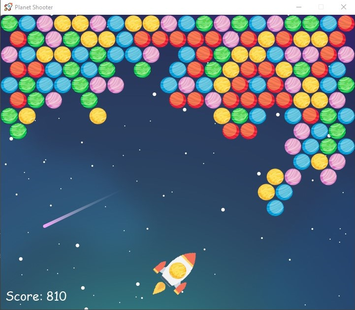

# Planet-Shooter
This is an alternative of the **Bubble Shooter** game made with *pygame*.

You need to match at least three planets of the same color to pop them and clear them off the board. The game ends when the planets reach the bottom line of the screen. The more planets destroyed in one shot, the more points scored. A player wins when there are no planets remaining on the playing field.
